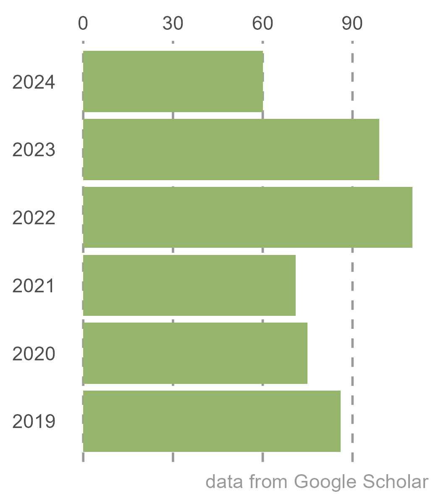

```{r, include=FALSE}
knitr::opts_chunk$set(
  results='asis', 
  echo = FALSE
)


CRANpkg <- function (pkg) {
    cran <- "https://CRAN.R-project.org/package"
    fmt <- "[%s](%s=%s)"
    sprintf(fmt, pkg, cran, pkg)
}

Biocpkg <- function (pkg) {
    sprintf("[%s](http://bioconductor.org/packages/%s)", pkg, pkg)
}

library(glue)
library(tidyverse)

# Set this to true to have links turned into footnotes at the end of the document
PDF_EXPORT <- FALSE

# Holds all the links that were inserted for placement at the end
links <- c()

find_link <- regex("
  \\[   # Grab opening square bracket
  .+?   # Find smallest internal text as possible
  \\]   # Closing square bracket
  \\(   # Opening parenthesis
  .+?   # Link text, again as small as possible
  \\)   # Closing parenthesis
  ",
  comments = TRUE)

sanitize_links <- function(text){
  if(PDF_EXPORT){
    str_extract_all(text, find_link) %>% 
      pluck(1) %>% 
      walk(function(link_from_text){
        title <- link_from_text %>% str_extract('\\[.+\\]') %>% str_remove_all('\\[|\\]') 
        link <- link_from_text %>% str_extract('\\(.+\\)') %>% str_remove_all('\\(|\\)')
        
        # add link to links array
        links <<- c(links, link)
        
        # Build replacement text
        new_text <- glue('{title}<sup>{length(links)}</sup>')
        
        # Replace text
        text <<- text %>% str_replace(fixed(link_from_text), new_text)
      })
  }
  
  text
}


# Takes a single row of dataframe corresponding to a position
# turns it into markdown, and prints the result to console.
build_position_from_df <- function(pos_df){
  
  missing_start <- pos_df$start == 'N/A'
  dates_same <- pos_df$end == pos_df$start
  if (pos_df$end == 9999) {
    pos_df$end = "present"
  }
  if(any(c(missing_start,dates_same))){
    timeline <- pos_df$end
  } else {
    timeline <- glue('{pos_df$end} - {pos_df$start}')
  }

  descriptions <- pos_df[str_detect(names(pos_df), 'description')] %>% 
    as.list() %>% 
    map_chr(sanitize_links)
  
  # Make sure we only keep filled in descriptions
  description_bullets <- paste('-', descriptions[descriptions != 'N/A'], collapse = '\n')
  
  if (length(description_bullets) == 1 && description_bullets == "- ") {
    description_bullets <- ""
  }
  glue(
"### {sanitize_links(pos_df$title)}

{pos_df$loc}

{pos_df$institution}

{timeline}

{description_bullets}


"
  ) %>% print()
}

# Takes nested position data and a given section id 
# and prints all the positions in that section to console
print_section <- function(position_data, section_id){
  x <- position_data %>% 
    filter(section == section_id) %>% 
    pull(data) 
  
  prese <- " - "
  xx <- list()

  for (i in seq_along(x)) {    
      y = x[[i]]
      y <- cbind(y, start2 = as.character(y$start))
      y <- cbind(y, end2 = as.character(y$end))

      se <- paste(y$start, "-", y$end, collapse = " ")
      if (prese == se) {
        y$start2 = ""
        y$end2 = ""
      } else {
        prese = se
      }

    xx[[i]] <- select(y, -c(start, end)) %>%
      rename(start=start2, end=end2)
  }
    
  xx %>% 
    purrr::walk(build_position_from_df)
}


fill_nas <- function(column){
  ifelse(is.na(column), 'N/A', column)
}
```

```{r, include=FALSE}
source("citation.R", local = knitr::knit_global())
# or sys.source("your-script.R", envir = knitr::knit_global())
```

```{r, include=FALSE}
# Load csv with position info
position_data <- read_csv('CV_larter.csv') %>% 
  mutate_all(fill_nas) %>% 
  arrange(order, desc(end)) %>% 
  mutate(id = 1:n()) %>% 
  nest(data = c(-id, -section))
```


```{r}
# When in export mode the little dots are unaligned, so fix that. 
if(PDF_EXPORT){
  cat("
  <style>
  :root{
    --decorator-outer-offset-left: -6.5px;
  }
  </style>")
}
```

Aside
================================================================================

<!-- {width=80%} -->

Disclaimer {#disclaimer}
--------------------------------------------------------------------------------
Last updated on `r Sys.Date()`.


```{r}
# When in export mode the little dots are unaligned, so fix that. 
if(PDF_EXPORT){
  cat("View this CV online with links at _maxlarter.github.io/cv_")
}
```

Contact {#contact}
--------------------------------------------------------------------------------
- <i class="fa fa-envelope"></i> maximilian.larter@gmail.com
- <i class="fa fa-twitter"></i> [.@MaxLarter](twitter.com/maxlarter)
- <i class="fa fa-link"></i> [maxlarter.github.io](maxlarter.github.io)
- <i class="fa fa-phone"></i> +33 679709275
- <i class="fa fa-home"></i> Biogeco, Bat B2, <br/>&nbsp;&nbsp;&nbsp;&nbsp;&nbsp;&nbsp; Allée Geoffroy St Hilaire<br/> &nbsp;&nbsp;&nbsp;&nbsp;&nbsp;&nbsp; Pessac, France
- <i class="fa fa-birthday-cake"></i> August 5th, 1987. Derby (UK)


Skills {#skills}
--------------------------------------------------------------------------------

**Languages**

- Fluent / native speaker in **English** and **French**.

**Software, statistics**

- SAS, R, Inkscape
- Phylogenetic comparative methods
- GIS

**Plant physiology**

- Plant hydraulics (Cavitron, optical technique)
- gas exchange, sapflow, dendrometry
- wood anatomy – microscopy (optical and SEM)
- anthocyanin extractions and separation (HPLC)

**Molecular biology, phylogenetics**

- DNA/RNA extractions
- qPCR
- Next Gen Sequencing library prep
- RAxML, BEAST, MrBayes

<br>


Main
================================================================================

Maximilian Larter {#title}
--------------------------------------------------------------------------------

I am a plant ecophysiologist and an evolutionary biologist. <br/>
My primary research interest is understanding how plants adapt to their environment, in particular in the current climate crisis, with rapidly changing temperature and rainfall patterns. By examining functional trait distributions of living and extinct lineages, we gain insight into the evolution of key physiological traits and functions, as well as the genetic mechanisms enabling these adaptations.<br/>
This knowledge is critical to predict the impacts of climate change on the distributions of wild species and crop health.

Research Experience {data-icon=laptop}
--------------------------------------------------------------------------------

```{r, results='asis', echo = FALSE}
print_section(position_data, 'research_positions')
```
<br>

Education {data-icon=graduation-cap data-concise=true}
--------------------------------------------------------------------------------

```{r, results='asis', echo = FALSE}
print_section(position_data, 'education')
```
<br>

::: aside

<br>
<br>
<br>
<br>
<br>
<br>


{width=100%}


:::

Publications {#publications data-icon=book}
--------------------------------------------------------------------------------


```{r}
print_section(position_data, 'academic_articles')
```


<br>

Grants and funding  {data-icon=chart-line}
--------------------------------------------------------------------------------

```{r}
print_section(position_data, 'Grants_&_funding')
```


<br>
<br>

Outreach and Press (by me) {data-icon=newspaper}
--------------------------------------------------------------------------------

```{r}
print_section(position_data, 'Outreach_Press_by_me')
```


<br>
<br/>
<br>
<br/>
<br>
<br/>
<br>
<br/>

Teaching Experience {data-icon=chalkboard-teacher}
--------------------------------------------------------------------------------

```{r}
print_section(position_data, 'Teaching_Experience')
```

<br>


Conferences and Presentations {data-icon=group}
--------------------------------------------------------------------------------

```{r}
print_section(position_data, 'Conferences_Presentations')
```

<br>

```{r}
if(PDF_EXPORT){
  cat("
  
Links {data-icon=link}
--------------------------------------------------------------------------------


")
  
  walk2(links, 1:length(links), function(link, index){
    print(glue('{index}. {link}'))
  })
}
```


