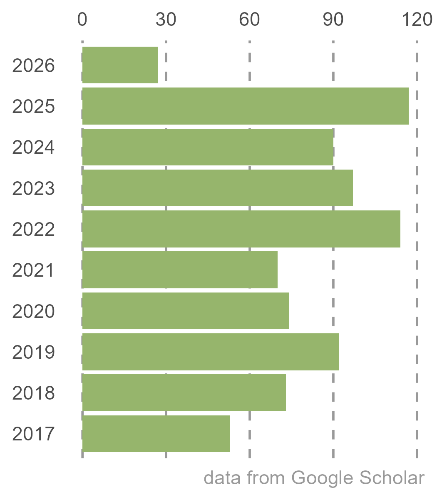

```{r, include=FALSE}
knitr::opts_chunk$set(
  results='asis', 
  echo = FALSE
)


CRANpkg <- function (pkg) {
    cran <- "https://CRAN.R-project.org/package"
    fmt <- "[%s](%s=%s)"
    sprintf(fmt, pkg, cran, pkg)
}

Biocpkg <- function (pkg) {
    sprintf("[%s](http://bioconductor.org/packages/%s)", pkg, pkg)
}

library(glue)
library(tidyverse)

# Set this to true to have links turned into footnotes at the end of the document
PDF_EXPORT <- FALSE

# Holds all the links that were inserted for placement at the end
links <- c()

find_link <- regex("
  \\[   # Grab opening square bracket
  .+?   # Find smallest internal text as possible
  \\]   # Closing square bracket
  \\(   # Opening parenthesis
  .+?   # Link text, again as small as possible
  \\)   # Closing parenthesis
  ",
  comments = TRUE)

sanitize_links <- function(text){
  if(PDF_EXPORT){
    str_extract_all(text, find_link) %>% 
      pluck(1) %>% 
      walk(function(link_from_text){
        title <- link_from_text %>% str_extract('\\[.+\\]') %>% str_remove_all('\\[|\\]') 
        link <- link_from_text %>% str_extract('\\(.+\\)') %>% str_remove_all('\\(|\\)')
        
        # add link to links array
        links <<- c(links, link)
        
        # Build replacement text
        new_text <- glue('{title}<sup>{length(links)}</sup>')
        
        # Replace text
        text <<- text %>% str_replace(fixed(link_from_text), new_text)
      })
  }
  
  text
}


# Takes a single row of dataframe corresponding to a position
# turns it into markdown, and prints the result to console.
build_position_from_df <- function(pos_df){
  
  missing_start <- pos_df$start == 'N/A'
  dates_same <- pos_df$end == pos_df$start
  if (pos_df$end == 9999) {
    pos_df$end = "present"
  }
  if(any(c(missing_start,dates_same))){
    timeline <- pos_df$end
  } else {
    timeline <- glue('{pos_df$end} - {pos_df$start}')
  }

  descriptions <- pos_df[str_detect(names(pos_df), 'description')] %>% 
    as.list() %>% 
    map_chr(sanitize_links)
  
  # Make sure we only keep filled in descriptions
  description_bullets <- paste('-', descriptions[descriptions != 'N/A'], collapse = '\n')
  
  if (length(description_bullets) == 1 && description_bullets == "- ") {
    description_bullets <- ""
  }
  glue(
"### {sanitize_links(pos_df$title)}

{pos_df$loc}

{pos_df$institution}

{timeline}

{description_bullets}


"
  ) %>% print()
}

# Takes nested position data and a given section id 
# and prints all the positions in that section to console
print_section <- function(position_data, section_id){
  x <- position_data %>% 
    filter(section == section_id) %>% 
    pull(data) 
  
  prese <- " - "
  xx <- list()

  for (i in seq_along(x)) {    
      y = x[[i]]
      y <- cbind(y, start2 = as.character(y$start))
      y <- cbind(y, end2 = as.character(y$end))

      se <- paste(y$start, "-", y$end, collapse = " ")
      if (prese == se) {
        y$start2 = ""
        y$end2 = ""
      } else {
        prese = se
      }

    xx[[i]] <- select(y, -c(start, end)) %>%
      rename(start=start2, end=end2)
  }
    
  xx %>% 
    purrr::walk(build_position_from_df)
}


fill_nas <- function(column){
  ifelse(is.na(column), 'N/A', column)
}
```

```{r, include=FALSE}
source("citation.R", local = knitr::knit_global())
# or sys.source("your-script.R", envir = knitr::knit_global())
```

```{r, include=FALSE}
# Load csv with position info
position_data <- read_csv('CV_larter_short.csv') %>% 
  mutate_all(fill_nas) %>% 
  arrange(order, desc(end)) %>% 
  mutate(id = 1:n()) %>% 
  nest(data = c(-id, -section))
```


```{r}
# When in export mode the little dots are unaligned, so fix that. 
if(PDF_EXPORT){
  cat("
  <style>
  :root{
    --decorator-outer-offset-left: -6.5px;
  }
  </style>")
}
```

Aside
================================================================================

<!-- {width=80%} -->

Disclaimer {#disclaimer}
--------------------------------------------------------------------------------
Last updated on `r Sys.Date()`.


```{r}
# When in export mode the little dots are unaligned, so fix that. 
if(PDF_EXPORT){
  cat("View this CV online with links at _maxlarter.github.io/cv_")
}
```

Contact {#contact}
--------------------------------------------------------------------------------
- <i class="fa fa-envelope"></i> maximilian.larter@gmail.com
- <i class="fa fa-twitter"></i> [.@MaxLarter](twitter.com/maxlarter)
- <i class="fa fa-link"></i> [maxlarter.github.io](https://maxlarter.github.io)
- <i class="fa fa-phone"></i> +33 679709275
- <i class="fa fa-home"></i> 10 rue HG Wells, <br/>&nbsp;&nbsp;&nbsp;&nbsp;&nbsp;&nbsp; 33600 Pessac, France
- <i class="fa fa-birthday-cake"></i> August 5th, 1987. Derby (UK)

<br>

Skills {#skills}
--------------------------------------------------------------------------------
- Native speaker in **English** and **French**
- data analysis, statistics (SAS, R, git), modelling
- QGIS, Inkscape
- Plant hydraulics, physiology, gas exchange
- Molecular biology, phylogenetics

<br>
<br>
<br>
<br>
<br>
<br>
<br>

Citations {#skills}
--------------------------------------------------------------------------------
873 citations, h-index 12
{width=100%}
<br>
<br>
<h4> [full publication list](https://maxlarter.github.io/publications/publications.html)</h4>
<br>

Main
================================================================================

Maximilian Larter {#title}
--------------------------------------------------------------------------------

<h3>I am a plant ecophysiologist and an evolutionary biologist. <br/>
My primary research interest is understanding how plants respond and adapt to their environment, especially under climate change. I study functional traits and key physiological processes, and use statistics and models to predict the impacts of climate change on the performance, survival, and future distributions of wild and cultivated species. </h3>

Research Experience {data-icon=laptop}
--------------------------------------------------------------------------------

```{r, results='asis', echo = FALSE}
print_section(position_data, 'research_positions')
```

Education {data-icon=graduation-cap data-concise=true}
--------------------------------------------------------------------------------

```{r, results='asis', echo = FALSE}
print_section(position_data, 'education')
```

```{css, echo=FALSE}
.pagedjs_page:not(:first-of-type) {
  --sidebar-width: 0rem;
  --sidebar-background-color: #ffffff;
  --main-width: calc(var(--content-width) - var(--sidebar-width));
  --decorator-horizontal-margin: 0.2in;
}
```

Selected Publications {#publications data-icon=book} 
--------------------------------------------------------------------------------

```{r}
print_section(position_data, 'academic_articles')
```

Grants and funding  {data-icon=chart-line}
--------------------------------------------------------------------------------

```{r}
print_section(position_data, 'Grants_&_funding')
```

Conferences and Presentations {data-icon=group}
--------------------------------------------------------------------------------

```{r}
print_section(position_data, 'Conferences_Presentations')
```

Professional service {data-icon=chalkboard-teacher}
--------------------------------------------------------------------------------

```{r}
print_section(position_data, 'Teaching_Experience')
```

```{r, include=FALSE}
# Load csv with position info
position_data2 <- read_csv('CV_larter.csv') %>% 
  mutate_all(fill_nas) %>% 
  arrange(order, desc(end)) %>% 
  mutate(id = 1:n()) %>% 
  nest(data = c(-id, -section))
```


```{r}
if(PDF_EXPORT){
  cat("
  
Links {data-icon=link}
--------------------------------------------------------------------------------


")
  
  walk2(links, 1:length(links), function(link, index){
    print(glue('{index}. {link}'))
  })
}
```


